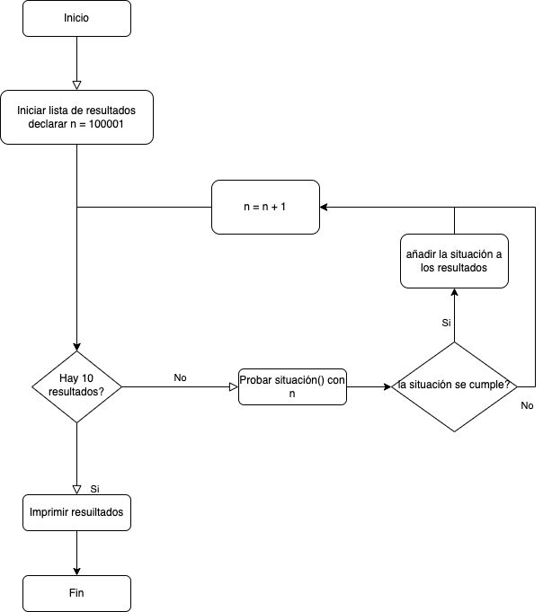

# El problema de los tres marineros y los “catils”

*Tomado del libro “El hombre que calculaba” (El Hombre que Calculaba www.librosmaravillosos.com Malba Tahan Colaboración de Guillermo Mejía Preparado por Patricio Barros Antonio Bravo)*

Un navío que volvía de Serendibe, trayendo gran cantidad de especias, fue alcanzado por violento temporal. La embarcación habría sido destruida por las olas, si no fuera por el valor y el esfuerzo de tres marineros que, en medio de la tormenta, manejaban las velas con extremada pericia. El capitán, queriendo recompensar a los denodados marineros, les dio cierto número de “catils” (monedas). Los “catils” eran más de doscientos y menos de trescientos. Las monedas fueron colocadas en una caja para que, al día siguiente, al desembarcar, el almojarife las repartiese entre los tres valientes.

Sucedió, sin embargo, durante la noche, uno de los tres marineros se despertó y pensó: “Sería mejor que retirase mi parte. Así no tendré oportunidad de discutir con mis amigos.” Y, sin decir nada a los compañeros, fue, en puntas de pie, hasta donde se hallaba guardado el dinero, lo dividió en tres partes iguales y notó que la división no era exacta, ya que sobraba un “catil”. –“Por causa de esta mísera monedita, es probable que mañana haya riña y discusión. Será mejor sacarla.” Y el marinero la tiró al mar, retirándose cauteloso. Llevaba su parte y dejaba las que correspondían a sus compañeros en el mismo lugar. 

Horas después el segundo marinero tuvo la misma idea. Fue al arca en que se depositara el premio colectivo y lo dividió en tres partes iguales. Sobraba una moneda. El marinero optó por tirarla al mar, para evitar posibles discusiones. Y salió de allí llevando la parte que creía le correspondía. 

El tercer marinero, ignorando, por completo, que sus compañeros se le habían anticipado, tuvo el mismo pensamiento. Se Levantó de madrugada y fue a la caja de los “catils”. Dividió las monedas que en ella encontró, y la división tampoco resultó exacta; sobró un “catil”. No queriendo complicar el reparto, el marinero la tiró al mar y regresó satisfecho a su litera. 

Al día siguiente, al desembarcar, el almojarife encontró un puñado de “catils” en la caja. Sabiendo que esas monedas pertenecían a los marineros, las dividió en tres porciones, que repartió entre sus dueños. Tampoco fue exacta la división. Sobraba una moneda, que el almojarife se guardó como retribución a su trabajo y habilidad. Es claro que ninguno de los marineros reclamó, pues cada uno estaba convencido de haber retirado su parte. Ahora bien: ¿cuántas eran las monedas? ¿Cuánto recibió cada marinero?

| Monedas en la caja | Dividas entre: | Da: | Residuo: | Monedas restantes: |
|--------------------|----------------|-----|----------|--------------------|
| 241                | 3              | 80  | 1        | 160                |
| 160                | 3              | 53  | 1        | 106                |
| 106                | 3              | 35  | 1        | 70                 |
| 70                 | 3              | 23  | 1        | 0                  |

División hecha por el 1.er marinero. Dividiendo 241 por 3 da 80 y sobra 1
División hecha por el 2º marinero. Dividiendo 160 por 3 da 53 y sobra 1
División hecha por el 3.er marinero. Dividiendo 106 por 3 da 35 y sobra 1
Última división: dividiendo 70 por 3 da 23 y sobra 1

El “Hombre que calculaba”, notando que la historia narrada por él, el príncipe despertara gran interés entre los nobles presentes, creyó necesario dar la solución completa del problema, y así lo hizo:

Las monedas eran, al principio, 241.

El primer marinero las dividió en tres partes; tiró un “catil” al mar y se llevó un tercio de 240, o sea, 80 monedas, dejando 160.
El segundo marinero halló, por lo tanto, 160 monedas; tiró una al mar y dividió las restantes (159) en tres partes. Tomó la tercera parte, o sea, 53, y dejó el resto, 106. 
El tercer marinero encontró en la caja 106 monedas, dividió ese resto en tres partes iguales, tirando al mar la moneda que sobraba. Retiró la tercera parte de 105, o sea, 35 monedas, dejando el resto, o sea 70.
El almojarife encontró 70 monedas, las dividió en tres partes iguales, tocando 23 monedas más a cada marinero. El reparto fue hecho, por lo tanto, de la manera
siguiente:

| Resultados:               |
|---------------------------|
| Marinero Nº 1 80+23 = 103 |
| Marinero Nº 2 53+23 = 76  |
| Marinero Nº 3 35+23 = 58  |
| Almojarife = 1            |
| Tiradas al mar = 3        |
| Total = 241               |

### Enunciado del problema:

Elabore un programa en Python que encuentre 10 números mayores que 100000 que cumplan las condiciones del enunciado anterior, indicando para cada número que cumple la condición, cuánto le tocó a cada marinero en cada repartición. 

**Condición Obligatoria:** desarrollarlo por el método de ensayo y error (nada de ecuaciones matemáticas). El programa debe reflejar obligatoriamente las 4 reparticiones con la instrucción “if” (se deben ejecutar 4 “if” para las cuatro reparticiones).

#### Restricciones:

1. Solo se puede usar listas para almacenar, tanto las cantidades que se lleva cada marinero en las reparticiones, como la cantidad de monedas que cumple la condición del enunciado
2. Solo hasta que se obtengan los resultados, estos deben presentarse en forma matricial antes de finalizar el programa

Solución: [Notebook](marineros_catils.ipynb)

#### Diagrama de flujo:

